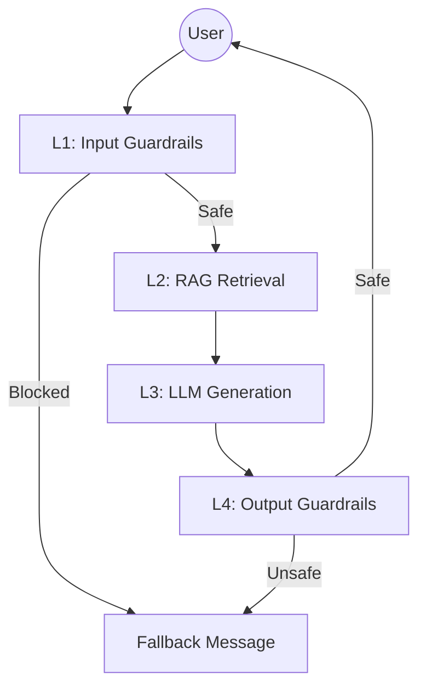

# System Blueprint: Eval & Guardrails Pipeline (Lab 24)

## 1. Service Level Objectives (SLOs)
| Metric | SLO Target | Alert Threshold |
| --- | --- | --- |
| P95 Latency | < 2000ms | > 2500ms |
| Faithfulness | > 0.85 | < 0.75 |
| PII Recall | > 90% | < 80% |
| Topic Accuracy | > 80% | < 70% |
| Guardrail Overhead | < 150ms | > 300ms |

## 2. Architecture Diagram (4 Layers)

- **L1 (Input)**: PII Redaction (Presidio + Regex) + Topic Validation (Zero-shot).
- **L2 (Retrieval)**: Vector DB search (Chroma/FAISS).
- **L3 (Generation)**: LLM (GPT-4o-mini).
- **L4 (Output)**: Llama Guard 3.

## 3. Incident Playbooks
### Scenario 1: Faithfulness Drops below 0.75
- **Step 1**: Check top 10 low-scoring samples in Ragas.
- **Step 2**: Inspect retrieval chunks (Context Precision). If low, tune chunk size or top-k.
- **Step 3**: If retrieval is fine, update system prompt to enforce groundedness.

### Scenario 2: P95 Latency Spikes > 2.5s
- **Step 1**: Identify the bottleneck (L1, L2, or L3) using latency logs.
- **Step 2**: If L3 (LLM), switch to a smaller model (e.g., Llama-3-8b via Groq).
- **Step 3**: Optimize L1 parallelization (async processing).

## 4. Operational Cost Estimation (100k queries/month)
- **LLM (GPT-4o-mini)**: ~$50 (Input/Output tokens).
- **Guardrails (Groq/Llama Guard)**: Free tier or ~$10 (Self-hosted/API).
- **Vector DB**: $0 (Local/Community Edition).
- **Total**: ~$60/month.
